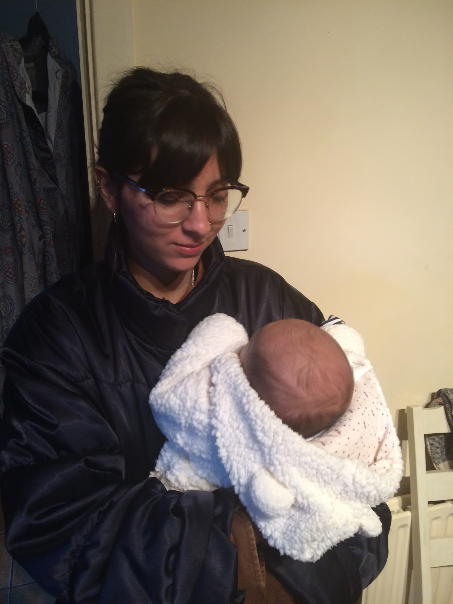
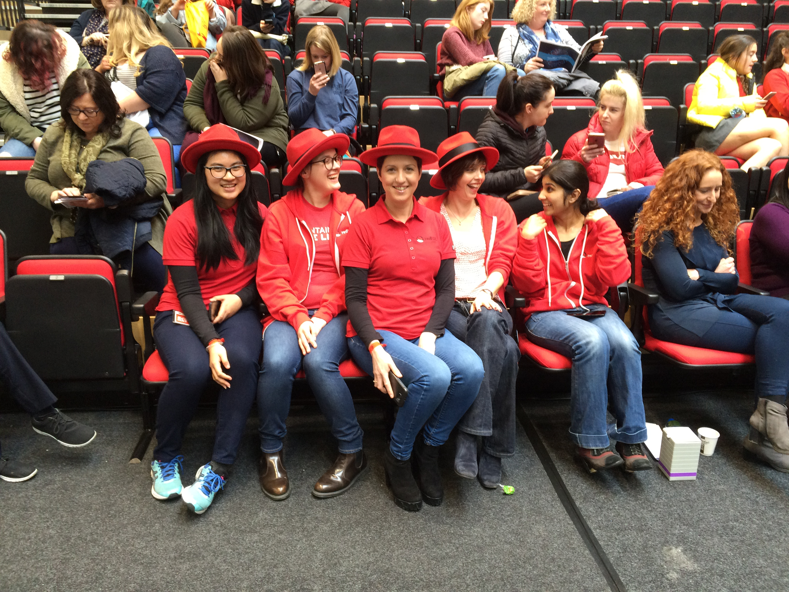

+++
date = "2018-08-22T10:48:33+01:00"
description = "A summary of my internship at Red Hat"
title = "Eight months at Red Hat Mobile"
+++

## The first three months 
I started my internship at Red Hat Mobile eight months ago with very little idea of what I was getting myself into. I thought I had a vague idea of what to expect, but I definitely didn’t think I would be working as part of a team on a real product, or on anything other than small bugs.

I started with 3 other interns. We were all placed in a team that matched our skillsets and were each assigned a buddy to help us ‘settle in’. I was put on the Mobile Core team and was assigned the best buddy I could have asked for. The buddy system really helped me get comfortable with my surroundings and settle into my new team. My buddy is very kind and approachable, which meant I could always ask stupid questions without her ever being condescending. I’ve harassed her endlessly in the past eight months and somehow she still listens to me! 

Mobile Core’s focus was helping mobile developers leverage Kubernetes/Openshift by integrating our Cloud Services onto the platform. When I first started, the team had just finished their first sprint and were moving on to the development of a command line tool (similar to oc or kubectl in experience) to interact with our Mobile Services and clients in Kubernetes. 
I learnt so much from working on the CLI and got a lot of help and guidance from my team members. I was also introduced to ‘pair programming’, which was a completely foreign experience to me, but it has definitely become one of the highlights of my internship (partly because of how cool everyone on my team is). I was fascinated to learn about everyone’s processes and how different they were from each other. Asking questions in real time also made a big difference. My team members are all so knowledgeable and I’ve been so lucky that they’re always so willing to help.  

In the meantime we had a few planning meetings for the South East Women in Technology event. I was able to sport my Red Hat gear and encourage young girls to consider tech at the Red Hat stand along with all of the women at Red Hat Mobile. A few Transition Year (TY) students also came for a week and we organised a colourful variety of sessions and workshops to get them thinking about a career in Computer Science. Being able to pass on our knowledge to them was a very rewarding experience, especially seeing their reception and their enthusiasm towards the topics we tackled together.

The snow came in march and being completely unprepared we were snowed in for a week. I got to pair program with one of my team members on the Openshift console. Although I soon discovered my strong dislike for front end development, I learnt an unbelievable amount from him, which made working on the console a little less intimidating. 

To top off everything that was going on, 2018 took the best possible turn when my first ever nephew, Arrigo Marco Troisi, was born. He is now six months old which seems surreal and  he definitely takes the award for cutest nephew in the world!

## The next three months
By the middle of my internship I had taken part in my first sprint planning and my first sprint retro and had pair programmed with almost everyone on the team. I had also done some work on the Android Studio plugin in Java, the Openshift Console in Angular & Javascript and my mind was completely blown by Ansible Playbook Bundles (APBs) and the Ansible Service Broker. I couldn’t wrap my head around how clever they were (still can’t) and how much translation was being done from the playbook to the broker to the console. I loved working on our APBs and tried to keep my focus on those for the most part, dodging Angular and demo videos as much as possible in between.

An opportunity came up to take part in Junior Achievement outreach at a local High School doing interviews for Transition Year students. We also had another student interested in Computer Science shadow us for the day. I was really impressed at the level of the students and although I wasn’t sure what to expect going in I thoroughly enjoyed doing it. More about my outreach experience [here](https://dimitraz.github.io/blog/post/outreach/).

The interns were also asked to do an interim brown bag lunch presentation on our experience up to now. I really enjoyed doing this because it forced me to sit down and take stock of what I had done, which was encouraging because it turned out to be a lot more than I thought.  I also made my first demo video (less scary than I anticipated!) and got my Professional Scrum Master I certificate (thank you to my fellow interns for forcing me).

## The last three months
The final part of my internship was focussed on Kubernetes and the Operator SDK. Although the Operator framework had been around for a while, the Operator SDK was brand new and gaining a lot of traction at the time. I had no idea what it was but our next few sprints were focussed on spikes for potential use cases.
I worked with another team member on an operator for our Mobile CI/CD APB, which would handle syncing any SDK packages necessary for building the user’s mobile apps. I also got a chance to look at our ‘Managed Services’ Broker and started some work on our new Keycloak Operator alongside some of my other team mates. 

 In the last few weeks I’ve been able to work with one of our newer team members on finishing the Keycloak Operator work and so far next to the APBs it’s been some of the most interesting/enjoyable work I’ve done. I’ve loved using Golang and I think I’m starting to get used to pointers, but that could also just be a false sense of security. 

Other than that, I’ve never been described as a social butterfly but to my surprise I’ve really enjoyed getting involved in some of the social activities in the office.
After the unfortunate end to Mick’s cinema club within my first week (their viewing of ‘Raw’ caused PTSD amongst attendees of the club), our office manager and the Social Club took over with Marvel movie cinema outings, games nights, Easter egg hunts, Summer days out, World Cup viewings, Friday pay day drinks, and more. We also discovered Seagull Bakery early on and managed to find any excuse to go during lunch break. We’ve had lunch breaks in Tramore, lunch breaks on the benches in the longest summer ever, shortly lived Starbucks runs, outings to Dunmore and countless games of pool, although I’ve been told not to bank on it as a career if the whole Computer Science thing doesn’t work out. Thanks to the other interns I also got to experience my first carvery, which was a HUGE culture shock. Definitely a very eventful eight months! 

## The last week
I’ll be honest in saying that this last year has been full of ups and downs. I’ve messed up a lot which helped me realise that those situations were always the ones I learnt the most from. Luckily my team was never judgemental and always patient. Looking back I’ve learnt so much more than I thought I would.

Here are a few other lessons I’ve learnt:

* Fake it till you make it! I struggle with self doubt a lot but it turns out a lot of other people in the tech industry seem to as well. I think it’s just a side effect of a very fast paced industry. I remember watching a really good [Ted Talk by Amy Cuddy](https://www.ted.com/talks/amy_cuddy_your_body_language_shapes_who_you_are/discussion?nolanguage=enhttp%3A) a few years ago which could be summarised in the sentence “Fake it till you become it”. Red Hat was a safe environment to make mistakes and learn from them.
* Be more honest and open. I went to visit my friend from GSoC a while ago and she told me that you can’t expect anyone to know what you’re thinking or what you want if you aren’t assertive about it. It seems obvious, but I’m not a very open person, so being honest and open is hard for me to do. It’s definitely not something that I’ve nailed down yet, but this internship has helped me work through that and it’s definitely a lesson I’ll be taking with me in my next job.
- Pushing myself out of my comfort zone allowed me to discover things I didn’t really think I would enjoy. Getting involved in the outreach was one of those things and has turned out to be one of my high points during the internship. Teaching other students meant I had to be confident in what I knew myself and I grew a lot from the experience. 

Thank you to my manager, my buddy and the entire Red Hat Waterford office for welcoming all of the interns and making it a great place to be a part of!
